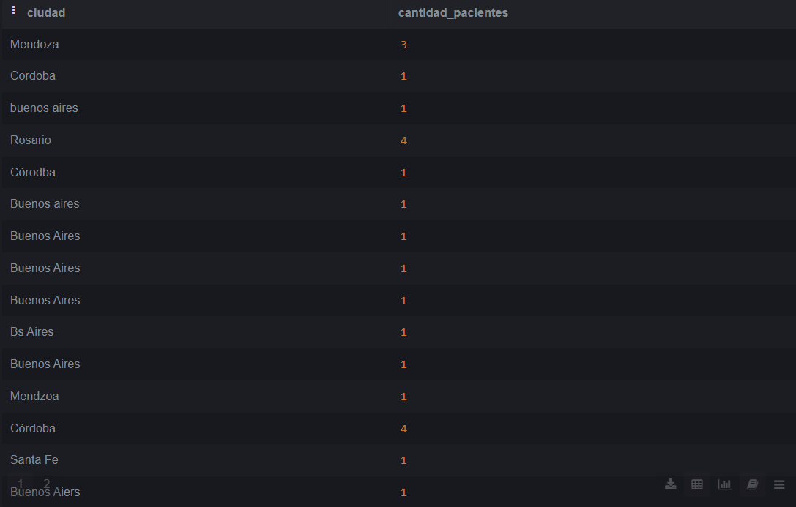
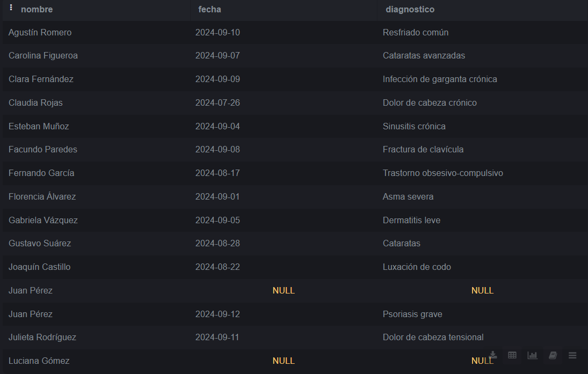
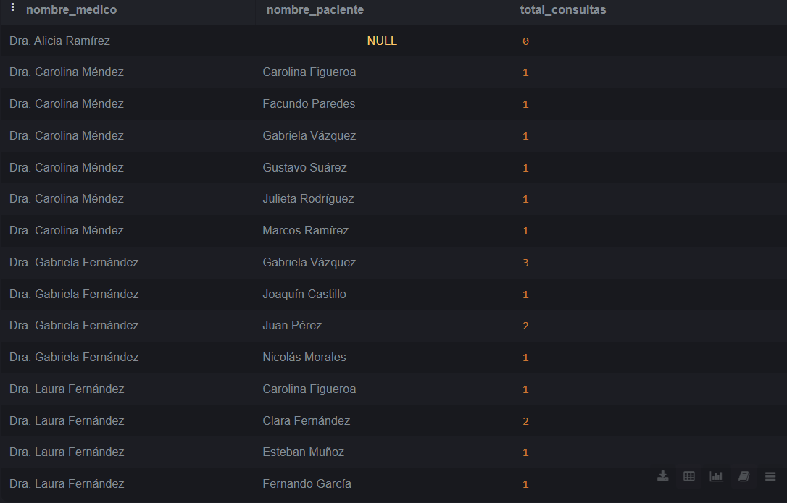

<p align="center">
  
</p>


# Informática Médica - ITBA

## Trabajo Práctico N° 4  
**Tema:** Bases de datos + Manejo de Versiones

---

###  Grupo N° 12

**Integrantes:**  
- **Erbin, Lola**  
   lerbin@itba.edu.ar  
- **De la Llave, Tomás**  
   tdelallave@itba.edu.ar  

---

###  Docentes

- **Carlos Lazzarino**  
   clazzarino@itba.edu.ar  
- **Ingrid Celia Spessotti**  
   ispessotti@itba.edu.ar  

---

###  Ciclo Lectivo  
**1° Cuatrimestre 2025**


# Parte 1

### Consigna 1

La base de datos mencionada es relacional, ya que organiza la información en tablas relacionadas entre sí mediante claves primarias y foráneas. Donde cada entidad (pacientes, médicos, recetas, consultas) se representa en una tabla, y las relaciones entre ellas se modelan a través de claves. 
Acorde a su clasificación funcional, es una base de datos transaccional, ya que su principal función es registrar y gestionar operaciones o transacciones del día a día en el centro de salud, como la atención a pacientes, la emisión de recetas y la consulta de información clínica.
La base de datos mencionada es relacional, ya que organiza la información en tablas relacionadas entre sí mediante claves primarias y foráneas. Donde cada entidad (pacientes, médicos, recetas, consultas) se representa en una tabla, y las relaciones entre ellas se modelan a través de claves. 
Acorde a su clasificación funcional, es una base de datos transaccional, ya que su principal función es registrar y gestionar operaciones o transacciones del día a día en el centro de salud, como la atención a pacientes, la emisión de recetas y la consulta de información clínica.

### Consigna 2


# Modelo de Entidades para la Base de Datos del Centro de Salud

## Paciente
- **Atributos**: Nombre, fecha de nacimiento, sexo biológico, dirección (compuesta por calle, número y ciudad).
- Se relaciona con **Consulta**, ya que es quien realiza la misma.

## Médico
- **Atributos**: Nombre, dirección profesional (compuesta por calle, número y ciudad).
- Se relaciona con **Consulta**, ya que es quien atiende la misma.
- Se relaciona con **Especialidad** mediante una participación **parcial**, ya que un médico puede no tener especialidades, tener una o tener varias.

## Especialidad
- **Atributos**: Descripción.
- Se considera una entidad separada para mantener la base de datos normalizada.
- Se relaciona con **Médico** mediante participación **parcial**, ya que pueden existir especialidades sin médicos asociados.

## Consulta
- **Atributos**: Fecha.
- Se relaciona con **Paciente** y **Médico** mediante participación **total**, ya que no puede existir una consulta sin ambos.
- Se relaciona con **Receta** mediante participación **parcial**, ya que no todas las consultas generan recetas.
  - Por cada consulta puede emitirse **una única receta**.

## Receta
- **Atributos**: Fecha, observaciones (pueden incluir síntomas, enfermedades o motivo de consulta).
- Se relaciona con **Consulta** mediante participación **total**.
- Se relaciona con **Tratamiento** mediante participación **total**, ya que no puede existir una receta sin tratamiento.

## Tratamiento (Entidad fuerte)
- **Atributos**: Indicaciones, especificaciones temporales, diagnósticos asociados.
- Se relaciona con **Receta** mediante participación **total**.
- Se relaciona con **Medicamento** mediante participación **parcial**, ya que un tratamiento puede o no incluir medicamentos.

## Medicamento (Entidad débil)
- **Atributos**: Nombre.
- Se relaciona con **Tratamiento** mediante participación **total**, ya que no puede existir un medicamento sin tratamiento.

---

Todas las entidades cuentan con su propio **id** como clave primaria para poder identificarlas inequívocamente.


### Consigna 3


### Consigna 4

La base de datos está normalizada porque cumple con las tres primeras formas normales: todos los atributos contienen valores indivisibles y están correctamente descompuestos (1FN), cada atributo depende completamente de la clave primaria de su tabla (2FN) y no existen dependencias transitivas entre atributos no clave (3FN).


# Parte 2: SQL

### Query 1

``` sql
-- Para optimizar la consulta que agrupa pacientes por ciudad, se creó un índice en la columna ciudad, lo cual reduce el tiempo de ejecución al evitar escaneos completos de tabla.

CREATE INDEX idx_paciente_ciudad ON pacientes(ciudad); 

-- La siguiente consulta permite agrupar de manera más eficiente los registros.

SELECT ciudad, COUNT(*) AS cantidad_pacientes

FROM pacientes

GROUP BY ciudad;

-- Se verificó la creación del indice mediante:
SELECT indexname, indexdef
FROM pg_indexes
WHERE tablename = 'pacientes';

```





 
### Query 2

```sql

-- Creo una vista ya que es un valor tipicamente consultado.

-- Considero que la informacion relevante son los datos del paciente como su numero, edad, ciudad y nombre.

CREATE VIEW vista_fechas_de_nacimiento_pacientes AS

SELECT nombre, numero, ciudad, EXTRACT(YEAR FROM AGE(current_date, fecha_nacimiento)) AS edad 

FROM pacientes;

-- Consulto la vista

SELECT * FROM vista_fechas_de_nacimiento_pacientes;

```


### Query 3

```sql


-- Actualizamos la direccion de Luciana Gomez en la base de datos

-- Asumo que no hay duplicados, si los hubiera tendria que agregar mas condiciones.

UPDATE pacientes

SET calle = 'Calle Corrientes 500', ciudad = 'Buenos Aires'

WHERE nombre = 'Luciana Gómez';

-- Confirmo que se haya cambiado correctamente la direccion.

SELECT * 

FROM pacientes 

WHERE nombre = 'Luciana Gómez';

```


### Query 4

```sql

SELECT nombre, matricula 

FROM medicos 

WHERE especialidad_id = 4;

```


### Query 5

```sql

-- Primero elimino espacios en blanco y pongo las primeras letras de cada palabra en mayuscula.

-- Tambien elimino los espacios duplicados.

UPDATE pacientes

SET ciudad = INITCAP(REGEXP_REPLACE(TRIM(ciudad), '\s+', ' ', 'g'));

-- Como hay ciudades que estan mal escritas, debo agregar una forma mas especifica de correccion para estos errores tipicos.

-- Por ejemplo podria ser lo siguiente.

UPDATE pacientes SET ciudad = 'Buenos Aires'
WHERE ciudad IN ('Bs As', 'Bsas', 'Buenosaires', 'Buenos Aiers', 'Bs Aires');

UPDATE pacientes SET ciudad = 'Córdoba'
WHERE ciudad IN ('Cordba', 'Cordova', 'Corodoba', 'Córodoba', 'Córodba', 'Cordoba');

UPDATE pacientes SET ciudad = 'Mendoza'
WHERE ciudad IN ('Mendzoa');

-- Visualizo todos los tipos de ciudades que tengo en mi tabla de pacientes

SELECT DISTINCT ciudad FROM pacientes ORDER BY ciudad;
 
```


### Query 6

```sql

-- Nombres y calles de los pacientes que viven en Buenos Aires.

SELECT nombre, calle FROM pacientes WHERE ciudad = 'Buenos Aires';

```


### Query 7

```sql

-- Es el mismo query que cree en la actividad 1.

SELECT ciudad, COUNT(*) AS cantidad_pacientes
FROM pacientes
GROUP BY ciudad;

```


### Query 8

```sql

SELECT ciudad, id_sexo, COUNT(*) AS cantidad_pacientes_sexo
FROM pacientes
GROUP BY ciudad, id_sexo
ORDER BY ciudad, id_sexo;

```


### Query 9

```sql


SELECT id_medico, COUNT(*) AS cantidad_recetas
FROM recetas
GROUP BY id_medico;

```


### Query 10

```sql

SELECT *

FROM consultas

WHERE id_medico = 3

  AND fecha >= '2024-08-01'
  
  AND fecha < '2024-09-01';

```
  


### Query 11

```sql

SELECT p.nombre, c.fecha, c.diagnostico
FROM consultas c
JOIN pacientes p ON c.id_paciente = p.id_paciente
-- NO ES NECESARIO UTILIZAR RIGHT O LEFT JOIN PORQUE AL FILTRAR POR FECHA EN LA TABLA DE CONSULTAS (CON WHERE) ESTOY ELIMINANDO LOS PACIENTES QUE NO HAYAN REALIZADO CONSULTAS EN ESE PERIODO
WHERE c.fecha >= '2024-08-01'
  AND c.fecha < '2024-09-01'
ORDER BY c.fecha;

```


### Query 12

```sql

SELECT m.nombre AS id_medicamento, COUNT(*) AS veces_prescripto
FROM recetas r
JOIN medicamentos m ON r.id_medicamento = m.id_medicamento
WHERE r.id_medico = 2
GROUP BY m.nombre
HAVING COUNT(*) > 1
ORDER BY veces_prescripto DESC;

```


### Query 13

```sql

SELECT 
  p.nombre, 
  COUNT(r.id_receta) AS total_recetas
FROM pacientes p
LEFT JOIN recetas r ON r.id_paciente = p.id_paciente
GROUP BY p.nombre
ORDER BY total_recetas DESC;

```


### Query 14

```sql

SELECT m.nombre AS nombre_medicamento, COUNT(*) AS cantidad_recetas
FROM recetas r
JOIN medicamentos m ON r.id_medicamento = m.id_medicamento
GROUP BY m.nombre
ORDER BY cantidad_recetas DESC
LIMIT 1;

```


### Query 15

```sql

SELECT 
  p.nombre, 
  c.fecha, 
  c.diagnostico
FROM pacientes p
LEFT JOIN consultas c ON c.id_paciente = p.id_paciente
  AND c.fecha = (
    SELECT MAX(c2.fecha)
    FROM consultas c2
    WHERE c2.id_paciente = p.id_paciente
  )
ORDER BY p.nombre;

```



### Query 16

```sql

SELECT 
  m.nombre AS nombre_medico,
  p.nombre AS nombre_paciente,
  COUNT(c.id_consulta) AS total_consultas
FROM medicos m
LEFT JOIN consultas c ON m.id_medico = c.id_medico
LEFT JOIN pacientes p ON c.id_paciente = p.id_paciente
GROUP BY m.nombre, p.nombre
ORDER BY m.nombre;

```
 


### Query 17

```sql

SELECT 
  med.nombre as nombre_medicamento,
  doc.nombre as nombre_medico,
  p.nombre as nombre_paciente,
  count(*) as total_recetas
 from recetas r
 
 join medicamentos med on r.id_medicamento = med.id_medicamento
 join medicos doc on r.id_medico = doc.id_medico
 join pacientes p on r.id_paciente = p.id_paciente
 
 group by med.nombre, doc.nombre, p.nombre
 order by total_recetas DESC;

```
 


### Query 18

```sql

SELECT 
  m.nombre AS nombre_medico,
  COUNT(DISTINCT c.id_paciente) AS total_pacientes
FROM medicos m
LEFT JOIN consultas c ON m.id_medico = c.id_medico
GROUP BY m.nombre
ORDER BY total_pacientes DESC;

```
 

